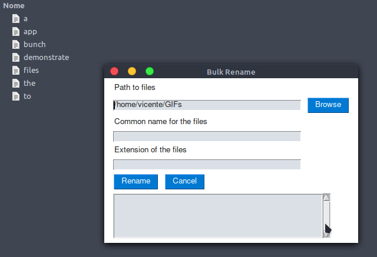

<h1 align="center">
  Multiple Files Renamer
   
</h1>

<h4 align="center">A simple Multiple Files Renamer built in Python</h4>

  <a href="#how-to-use">How To Use</a> •
  <a href="#download">Download</a> •
  <a href="#credits">Credits</a> •
  <a href="#related">Related</a> •
  <a href="#license">License</a>

## How To Use

To run this app just download the latest release and execute.

Or you can clone the repository and execute as a python program, you will need python and pysimplegui installed on computer.

On the app, if you want to rename all the files and their extensions, just fill every field. If you want to rename only the name, fill the Common name field. If you want to rename only the extension, fill the Extension of the file.

## Download

You can [download](https://github.com/ryuvi/Multiple-Files-Renamer/releases/tag/1.0.0) the latest stable version of Markdownify for Windows, macOS and Linux.

## Credits

This software uses the following open source packages:

- [Python](https://www.python.org/)
- [PySimpleGUI](https://pysimplegui.readthedocs.io/en/latest/)

## License

[MIT](https://github.com/ryuvi/Multiple-Files-Renamer/blob/main/LICENSE)
